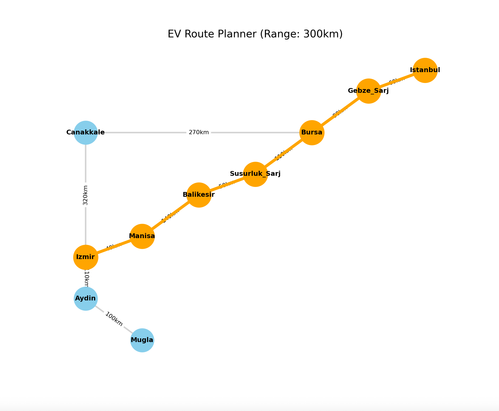

# ⚡ EV Range & Charging Route Optimizer

## 📌 Project Overview
A Python-based algorithmic solution to solve **"Range Anxiety"** for Electric Vehicles. This project calculates the optimal route between cities using **Graph Theory**, considering battery constraints and charging station locations.

## 🛠️ Technologies Used
* **Language:** Python
* **Libraries:** NetworkX (Graph Algorithms), Matplotlib (Visualization)
* **Algorithm:** Dijkstra’s Shortest Path Algorithm (Weighted by Distance)

## 🚀 Key Features
* **Route Planning:** Finds the most efficient path from Source to Destination.
* **Battery Logic:** Simulates battery consumption based on distance (km) and vehicle range (300km).
* **Smart Alerts:** Warns the driver if the destination is unreachable without charging (Orange Route) vs. Reachable (Green Route).
* **Data Visualization:** Plots the graph network with nodes (cities) and edges (roads) dynamically.
